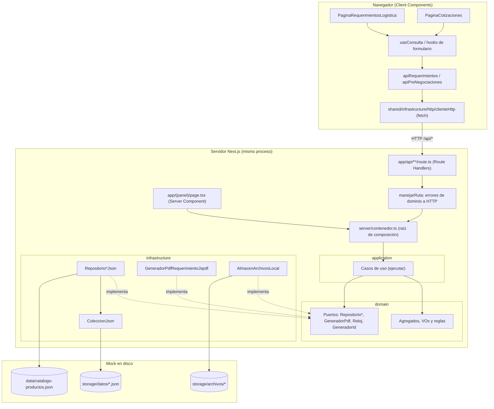
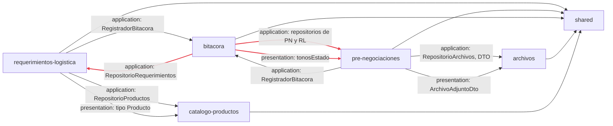
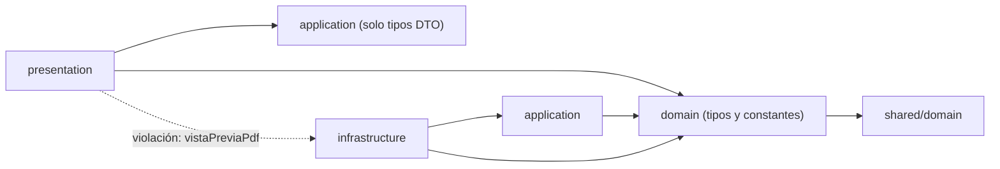
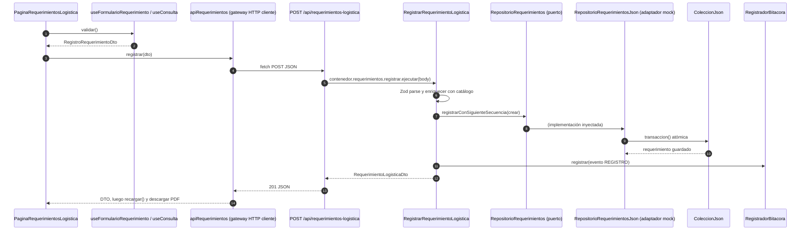

# Zeus Safety · Sistema de Importaciones (módulos)

> Documento de auditoría arquitectónica y guía técnica del repositorio `zeus-importaciones` (`package.json`).
> Convención usada en todo el documento:
> - **Evidencia**: ruta real del repositorio.
> - **No evidenciado**: no existe en el código/configuración.
> - **Inferencia**: conclusión razonada; se indica en qué se basa.

---

## Índice

1. [Descripción del proyecto y estado actual](#1-descripción-del-proyecto-y-estado-actual)
2. [Stack tecnológico](#2-stack-tecnológico)
3. [Arquitectura y decisiones de diseño](#3-arquitectura-y-decisiones-de-diseño)
4. [Estructura del proyecto](#4-estructura-del-proyecto)
5. [Módulos implementados](#5-módulos-implementados)
6. [Sprints completados (insumo para Impact Mapping)](#6-sprints-completados-insumo-para-impact-mapping)
7. [Diagramas de arquitectura](#7-diagramas-de-arquitectura)
8. [Estrategia de mocks y transición a backend real](#8-estrategia-de-mocks-y-transición-a-backend-real)
9. [Guía de crecimiento](#9-guía-de-crecimiento)
10. [Deuda técnica y recomendaciones](#10-deuda-técnica-y-recomendaciones)
11. [Cómo ejecutar el proyecto](#11-cómo-ejecutar-el-proyecto)
12. [Supuestos y preguntas para el equipo](#12-supuestos-y-preguntas-para-el-equipo)

---

## 1. Descripción del proyecto y estado actual

Aplicación web del **Sistema de Importaciones de Zeus Safety**, organizada por módulos de negocio. Hoy cubre la etapa de **pre-negociación**, con requerimientos de logística y cotizaciones con proveedores, más un panel de **bitácora y reportes**.

### Estado real frente a lo declarado

| Declaración del equipo | Lo que muestra el código |
|---|---|
| "Solo frontend, sin backend ni BD" | **Parcialmente cierto.** No hay backend externo ni base de datos. Sin embargo, la app Next.js incluye un **backend simulado dentro del mismo proceso**: *Route Handlers* en `src/app/api/**` que ejecutan casos de uso y guardan datos en **archivos JSON en disco** (`src/modules/shared/infrastructure/persistencia/ColeccionJson.ts`). |
| "Datos desde mocks" | **Sí, pero no con MSW ni json-server.** El mock es un **adaptador de persistencia en archivos JSON**: `storage/datos/*.json` (lectura y escritura), `storage/archivos/*` (binarios subidos) y `data/catalogo-productos.json` (catálogo de 25 productos, solo lectura). MSW, json-server y faker: **No evidenciado**. |
| "Usamos DDD y Clean Code" | **Aplicado en buena medida en el lado servidor** (dominio, aplicación, infraestructura, puertos y una raíz de composición). Hay brechas concretas, detalladas en la [sección 10](#10-deuda-técnica-y-recomendaciones). |

### Qué se puede hacer hoy

- Registrar **requerimientos de logística** (código `REG_LOG NN`), con vista previa del PDF, firmas digitales, aprobación y descarga del PDF.
- Registrar y editar **pre-negociaciones** ("Cotizaciones") con múltiples cotizaciones por proveedor, contactos, adjuntos, estados, filtros y vista maestro-detalle.
- Consultar el **panel principal** con indicadores, gráficos y línea de tiempo de la bitácora.
- **Exportar** los listados a Excel y PDF.

### Datos del repositorio

- Historial Git: **un solo commit** (`7ece5b4`, 2026-09-28, "fix: implementacion de nuevo sistema de importaciones Zeus (Nuevos modulos)"), con 166 archivos y 14 222 inserciones. No hay tags. Rama `main`; remoto `github.com/ZeusSafety/importaciones-modulos`.
- Aproximadamente 9 000 líneas en `src/`.

---

## 2. Stack tecnológico

Versiones resueltas en `pnpm-lock.yaml` (`lockfileVersion: '9.0'`).

| Tecnología | Versión | Categoría | Uso en el proyecto | Ruta de evidencia |
|---|---|---|---|---|
| **pnpm** | 11.24.0 | Gestor de paquetes | Gestor oficial (`packageManager`). Se usa `nodeLinker: hoisted` y `allowBuilds` para `sharp` y `unrs-resolver`. | `package.json`, `pnpm-workspace.yaml`, `pnpm-lock.yaml`, `.npmrc` |
| **Next.js** (App Router) | 16.0.7 | Framework UI + servidor | Enrutamiento por archivos, layouts, *Route Handlers* (el backend simulado), Server Components (panel principal), `next/font`, `next/image`, `next/link` | `src/app/**`, `next.config.ts` |
| **React / React DOM** | 19.2.0 | Librería UI | Componentes cliente (`"use client"`), `useReducer`, `useSyncExternalStore`, Context | `src/modules/*/presentation/**` |
| **TypeScript** | 5.9.3 | Lenguaje | `strict`, `noImplicitOverride`, `allowJs: false`, alias `@/*` | `tsconfig.json` |
| **Turbopack** | (incluido en Next 16) | Bundler | Configuración de `turbopack.root`. **Inferencia:** es el bundler por defecto de `next dev`/`next build` en Next 16, y no hay configuración de Webpack. | `next.config.ts` |
| **Tailwind CSS** | 4.3.3 | Estilos | Utilidades, `@theme` con tokens `zeus-*`, variante `dark` personalizada | `src/app/globals.css`, `postcss.config.mjs` |
| **@tailwindcss/postcss** | 4.3.3 | Build CSS | Plugin PostCSS | `postcss.config.mjs` |
| Sistema de diseño propio | — | UI / tokens | Tokens CSS (`--color-zeus-azul`, `--color-superficie`, etc.) con reasignación en modo oscuro, más un kit de componentes propio (`Boton`, `Modal`, `Selector`, `Insignia`, `Paginacion`, `Formulario`, etc.) | `src/app/globals.css`, `src/modules/shared/presentation/ui/*` |
| **framer-motion** | 13.4.4 | Animación | Transiciones de layout, modales, gráficos y apariciones | `shared/presentation/layout/MarcoAplicacion.tsx`, `shared/presentation/ui/Aparicion.tsx`, `shared/presentation/graficos/*` |
| **react-icons** | 5.7.0 | Iconos | Heroicons v2 (`hi2`) y Font Awesome 6 (`fa6`) | `shared/presentation/layout/navegacion.ts`, páginas |
| **next/font/google** (Inter, Poppins) | (Next) | Tipografía | Variables `--font-inter` y `--font-poppins` | `src/app/layout.tsx` |
| **Zod** | 4.6.5 | Validación | Esquemas de entrada de los casos de uso (DTOs), validación del catálogo JSON y mapeo de `ZodError` a HTTP 400 | `*/application/dto.ts`, `catalogo-productos/infrastructure/RepositorioProductosJson.ts`, `shared/infrastructure/http/manejarRuta.ts` |
| Formularios | — | Formularios | **Manuales**: `useState`/`useReducer` y validación cliente propia. React Hook Form: **No evidenciado**. | `pre-negociaciones/presentation/formulario/useFormularioPreNegociacion.ts`, `requerimientos-logistica/presentation/useFormularioRequerimiento.ts` |
| **fetch** nativo | — | Cliente HTTP | Envoltorio `obtenerJson`, `enviarJson`, `enviarFormulario` y `ErrorHttp`. Axios: **No evidenciado**. | `shared/infrastructure/http/clienteHttp.ts` |
| Persistencia JSON en disco | — | Mock / "backend" | `ColeccionJson<T>` con escritura atómica (archivo temporal + `rename`) y cerrojos en `globalThis` | `shared/infrastructure/persistencia/ColeccionJson.ts`, `rutasAlmacenamiento.ts` |
| **server-only** | 0.0.1 | Frontera cliente/servidor | Impide importar infraestructura de servidor desde el cliente | `src/server/contenedor.ts`, `*/infrastructure/*.ts` |
| **jsPDF** | 4.2.1 | PDF | PDF del requerimiento (servidor y vista previa en navegador) y exportación de tablas | `requerimientos-logistica/infrastructure/pdf/*`, `shared/presentation/exportacion/exportarTablaPdf.ts` |
| **jspdf-autotable** | 5.0.8 | PDF (tablas) | Tablas dentro de los PDF | Mismas rutas; declarado en `serverExternalPackages` en `next.config.ts` |
| **ExcelJS** | 4.4.0 | Excel | Exportación a `.xlsx` con logo; se carga con `import()` dinámico | `shared/presentation/exportacion/exportarTablaExcel.ts` |
| Gráficos | — | Gráficos | **Propios en SVG** + framer-motion (dona, columnas, medidor). Sin librería de gráficos. | `shared/presentation/graficos/*` |
| Tablas | — | Tablas | **Propias** (`<table>` + clase `.tabla-zeus` + `Paginacion`). TanStack Table: **No evidenciado**. | `pre-negociaciones/presentation/listado/TablaPreNegociaciones.tsx`, `globals.css` |
| Fechas | — | Utilidad | `Intl.DateTimeFormat` nativo con zona `America/Lima`. date-fns/dayjs: **No evidenciado**. | `shared/domain/fechas.ts`, `shared/presentation/ui/calendario.ts` |
| i18n | — | Internacionalización | **No evidenciado**. Textos en español y locale `es-PE` fijo en el código. | `shared/domain/texto.ts`, `fechas.ts` |
| Estado | — | Estado | Local (`useState`/`useReducer`), Context para notificaciones, `useSyncExternalStore` para el tema y hook propio `useConsulta` para datos remotos. Redux, Zustand y TanStack Query: **No evidenciado**. | `shared/presentation/hooks/useConsulta.ts`, `ui/Notificaciones.tsx`, `tema/tema.ts` |
| **ESLint** | 9.39.5 | Calidad | Flat config con `core-web-vitals` y `typescript` | `eslint.config.mjs` |
| **eslint-config-next** | 16.0.7 | Calidad | Reglas de Next, React Hooks y TypeScript | `eslint.config.mjs` |
| @types/node, @types/react, @types/react-dom | 22.20.4 / 19.3.0 / 19.3.0 | Tipos | Tipado | `package.json` |
| Prettier | — | Formato | **No evidenciado** | — |
| Husky / lint-staged / commitlint | — | Git hooks | **No evidenciado** | — |
| Convención de commits | — | Git | **Inferencia:** prefijo estilo Conventional Commits (`fix:`) en el único commit. No hay regla que lo imponga. | `git log` |
| Testing (Vitest, Jest, Testing Library, Playwright, Cypress, Storybook) | — | Testing | **No evidenciado**. Cobertura: **0 %** (no existen archivos `*.test.*` ni `*.spec.*`). | — |
| Variables de entorno | — | Configuración | `NEXT_PUBLIC_URL_ZEUS_IMPORTACION` (obligatoria: se valida al cargar) | `.env.example`, `shared/presentation/configuracion.ts` |
| Alias de imports | — | Configuración | `@/*` apunta a `./src/*` | `tsconfig.json` |
| Docker | — | Infraestructura | **No evidenciado** | — |
| CI/CD | — | Infraestructura | **No evidenciado** (no existe `.github/`) | — |
| Versión de Node | — | Runtime | No se declara (`engines` y `.nvmrc`: **No evidenciado**). **Inferencia:** Next 16 exige Node ≥ 20.9. | — |

---

## 3. Arquitectura y decisiones de diseño

### 3.1 Estilo arquitectónico real

**Monolito modular por dominio (*feature-based*) con capas de Clean Architecture/hexagonal dentro de cada módulo**, desplegado como una sola app Next.js que funciona a la vez como UI y como BFF simulado.

```
src/modules/<modulo>/
  domain/          ← entidades, value objects, reglas y puertos (interfaces)
  application/     ← casos de uso, DTOs (Zod) y mappers
  infrastructure/  ← adaptadores: JSON en disco, jsPDF, sistema de archivos
  presentation/    ← componentes React, hooks y cliente HTTP del módulo
src/app/           ← solo enrutamiento: páginas delgadas y Route Handlers delgados
src/server/contenedor.ts ← raíz de composición (inyección de dependencias manual)
```

| Decisión | Evidencia | Para qué (escalabilidad) |
|---|---|---|
| Módulos por dominio de negocio en `src/modules/*` | `requerimientos-logistica`, `pre-negociaciones`, `bitacora`, `archivos`, `catalogo-productos`, `shared` | Cada capacidad de negocio crece aislada; agregar un módulo no obliga a tocar carpetas técnicas globales. |
| Capas `domain/application/infrastructure/presentation` en cada módulo | Todos los módulos | Las reglas de negocio no dependen de framework ni de almacenamiento, así que se puede cambiar el almacenamiento sin reescribir reglas. |
| Repositorios como **interfaces en `domain/`** | `requerimientos-logistica/domain/RepositorioRequerimientos.ts`, `pre-negociaciones/domain/RepositorioPreNegociaciones.ts`, `archivos/domain/puertos.ts`, `bitacora/domain/RepositorioBitacora.ts`, `catalogo-productos/domain/RepositorioProductos.ts` | Es el punto de intercambio mock → API/BD real. |
| Puertos técnicos `Reloj` y `GeneradorId` | `shared/domain/puertos.ts`, `shared/infrastructure/sistema.ts` | Casos de uso deterministas y testeables (se puede inyectar un reloj falso). |
| **Raíz de composición única** | `src/server/contenedor.ts` | Un solo lugar para cambiar adaptadores (JSON → HTTP → BD). |
| Route Handlers delgados | `src/app/api/**/route.ts` (solo llaman a `contenedor.*.ejecutar` dentro de `manejarRuta`) | La lógica no queda en el framework; la ruta HTTP es solo un adaptador de entrada. |
| Traducción de errores de dominio a HTTP | `shared/domain/errores.ts` + `shared/infrastructure/http/manejarRuta.ts` (400/404/409/500) | Contrato de error uniforme (`RespuestaError`, en `contratoHttp.ts`) que el cliente ya sabe leer (`ErrorHttp`). |
| DTOs de entrada validados con Zod en la capa de aplicación | `*/application/dto.ts` | Los casos de uso reciben `unknown` y validan: sirven igual detrás de una API real. |
| Frontera cliente/servidor con `server-only` | `contenedor.ts`, repositorios JSON, `sistema.ts` | Evita filtrar `node:fs` al bundle del navegador. |
| Escrituras atómicas y serializadas | `ColeccionJson.transaccion`, `registrarConSiguienteSecuencia`, `modificar` | Evita correlativos duplicados en el mock. El contrato "atómico" ya queda expresado en el puerto. |
| Páginas de `app/` delgadas | `src/app/(panel)/pre-negociacion/*/page.tsx` | El routing es reemplazable; la UI vive en el módulo. |
| Kit UI y hooks compartidos | `shared/presentation/ui/*`, `hooks/*` | Consistencia visual y menos duplicación entre módulos. |
| Tokens de diseño con modo oscuro por reasignación de variables | `globals.css` (`.dark { --color-… }`) | Se evitan clases `dark:` en cada componente; los módulos nuevos heredan el tema sin trabajo extra. |
| Carga diferida de librerías pesadas | `import("exceljs")`, `import("jspdf")` en `shared/presentation/exportacion/*` | Bundle inicial más liviano. |
| Lenguaje ubicuo en español de negocio | `PreNegociacion`, `Cotizacion`, `Contacto`, `RequerimientoLogistica`, `aprobar()`, `TipoCarga`, `Puerto` | El código se entiende en los términos del área de importaciones. |

### 3.2 Verificación DDD (táctico y estratégico)

| Concepto | Estado | Evidencia / comentario |
|---|---|---|
| Bounded Contexts | **Parcial** | Los módulos corresponden a subdominios (pre-negociación, logística, archivos, catálogo, bitácora). No hay *context map* documentado, y `bitacora` mezcla dos responsabilidades: auditoría y reportes/dashboard (`bitacora/application/ObtenerPanelPrincipal.ts`). |
| Entities / Aggregate Roots | **Sí** | `RequerimientoLogistica` (constructor privado, factorías `registrar` y `desdePrimitivos`, transición `aprobar()` inmutable) y `PreNegociacion` (raíz que controla `Cotizacion` y `Contacto` e invariantes como IDs únicos y fechas editables intercaladas). |
| Value Objects | **Parcial** | `CodigoRequerimiento` es un VO real. El resto son uniones literales (`Mes`, `Area`, `TipoCarga`, `EstadoPreNegociacion` en `*/domain/valores.ts`) y funciones validadoras (`validarOrigen`, `validarFirmaDigital`, `textoMayusculasRequerido`), no VOs encapsulados. |
| Entidades anémicas | **Sí, en módulos de soporte** | `ArchivoAdjunto` (interfaz + factoría `crearArchivoAdjunto`), `Producto` (interfaz), `EventoBitacora` (interfaz). Es aceptable en subdominios genéricos. |
| Domain Services | **Parcial** | Reglas como funciones de dominio: `reglasContacto.ts`, `origenesImportacion.ts`. |
| Repositories como puertos | **Sí** | Interfaces en `domain/` e implementaciones `*Json` en `infrastructure/`. |
| Use Cases / Application Services | **Sí** | Una clase por caso de uso con `ejecutar()`: `RegistrarRequerimientoLogistica`, `AprobarRequerimientoLogistica`, `RegistrarPreNegociacion`, `ActualizarPreNegociacion`, `SubirArchivo`, `BuscarProductos`, `ObtenerPanelPrincipal`, etc. |
| DTOs y mappers | **Parcial** | Los DTOs de entrada están bien separados (Zod). Los **DTOs de salida son alias de los primitivos del dominio** (`RequerimientoLogisticaDto = RequerimientoLogisticaPrimitivos`, `PreNegociacionDto = PreNegociacionPrimitivos`), así que el contrato HTTP queda acoplado a la forma interna del agregado. El único mapper explícito es `aArchivoAdjuntoDto` (`archivos/application/dto.ts`). |
| Domain Events | **No evidenciado** | La bitácora se alimenta con **llamadas síncronas directas** a `RegistradorBitacora.registrar()` desde los casos de uso. No existe bus ni eventos tipados. |
| Lenguaje ubicuo | **Sí** | Nombres de negocio en español en todas las capas. |

### 3.3 Verificación Clean Architecture

| Regla | Estado | Evidencia |
|---|---|---|
| El dominio no importa React, Next, Zod, jsPDF ni `node:*` | **Cumple** | La búsqueda de esos imports en `src/modules/**/domain/**` no arroja resultados. |
| La aplicación depende solo del dominio y de sus puertos | **Cumple, con matiz** | Usa Zod (aceptable). Depende del **tipo concreto** `RegistradorBitacora` de otro módulo, no de una interfaz propia (`requerimientos-logistica/application/*.ts`, `pre-negociaciones/application/CasosUsoPreNegociaciones.ts`). |
| Inversión de dependencias | **Cumple en servidor** | `contenedor.ts` inyecta los adaptadores. |
| La presentación no depende de infraestructura | **Violación puntual** | `requerimientos-logistica/presentation/vistaPreviaPdf.ts` importa `../infrastructure/pdf/plantillaRequerimientoPdf`. Varias vistas importan `mensajeDeError` y el cliente HTTP desde `shared/infrastructure/http/clienteHttp.ts`; es infraestructura del lado cliente sin un puerto intermedio. |
| La presentación consume casos de uso | **No aplica en el cliente** | En el cliente, los componentes llaman a objetos `apiRequerimientos` y `apiPreNegociaciones` (`presentation/api*.ts`), que son *gateways* HTTP concretos sin interfaz. La frontera real es el **contrato HTTP**. |
| Presentación → dominio | **Uso directo** | La presentación importa listas y tipos del dominio (`valores.ts`, `origenesImportacion.ts`, `reglasContacto.ts`). Evita duplicar datos, pero esas constantes (países, puertos, áreas) se volverán **datos maestros del backend** (ver sección 10). |

### 3.4 Otros aspectos evaluados

- **Separación lógica/UI:** buena. Las reglas están en el dominio; los formularios tienen un modelo propio (`formulario/modeloFormulario.ts`, `useFormularioPreNegociacion.ts`) con reductor puro. Aun así, la validación se **duplica** en el cliente (`convertirAGuardar`, `useFormularioRequerimiento.validar`) y en el dominio.
- **Estado:** local por página, sin estado global excesivo. Los datos remotos pasan por `useConsulta` (sin caché, deduplicación ni invalidación). El panel principal es un Server Component que llama a `contenedor` directamente, sin HTTP (`src/app/(panel)/page.tsx`, con `dynamic = "force-dynamic"`).
- **Errores y carga:** unificados con `EstadoConsulta` (`cargando | listo | error`), `ResultadoConsulta` con reintento, notificaciones (`ui/Notificaciones.tsx`) y `ErrorHttp`.
- **Tipado:** estricto, con uniones discriminadas (`ModoFormulario`, `FechaContactoFormulario`) y `as const satisfies`.
- **Code splitting:** **Inferencia:** App Router divide el código por ruta automáticamente. Además hay `import()` dinámico para exportadores. No se usa `next/dynamic` para componentes.
- **Rutas por módulo:** las páginas viven en `src/app/(panel)/…` y el menú está centralizado en `shared/presentation/layout/navegacion.ts`. Cada módulo nuevo exige editar ese archivo compartido.
- **Acoplamiento entre módulos:** ver el diagrama de la [sección 7.2](#72-dependencias-entre-módulos-y-capas). Existe una **dependencia circular a nivel de módulo**: `pre-negociaciones` y `requerimientos-logistica` dependen de `bitacora`, y `bitacora` depende de ambos. No hay *barrels* (`index.ts`) ni API pública por módulo; todos los imports son profundos.

---

## 4. Estructura del proyecto

```
importaciones-modulos/
├── data/
│   └── catalogo-productos.json        # Mock de solo lectura (25 productos), versionado
├── storage/                           # Mock de lectura/escritura (en .gitignore, se crea al usarse)
│   ├── datos/                         #   pre-negociaciones.json, requerimientos-logistica.json,
│   │                                  #   bitacora.json, archivos.json
│   └── archivos/                      #   binarios subidos (<uuid>.pdf|.xlsx|…)
├── public/
│   ├── favicon/                       # Iconos y site.webmanifest
│   └── images/                        # Logos Zeus, banner y banderas de países
├── src/
│   ├── app/                           # SOLO enrutamiento (Next App Router)
│   │   ├── layout.tsx                 # HTML raíz, fuentes, script de tema y ProveedorNotificaciones
│   │   ├── globals.css                # Tailwind v4, tokens Zeus y modo oscuro
│   │   ├── (panel)/                   # Grupo de rutas con MarcoAplicacion (sidebar + cabecera)
│   │   │   ├── layout.tsx
│   │   │   ├── page.tsx               # "/"  → Bitácora y Reportes (Server Component)
│   │   │   └── pre-negociacion/
│   │   │       ├── cotizaciones/page.tsx
│   │   │       └── requerimientos-logistica/page.tsx
│   │   └── api/                       # Backend simulado (Route Handlers)
│   │       ├── archivos/              # POST (multipart) · GET [id]
│   │       ├── pre-negociaciones/     # GET · POST · PUT [id] · GET siguiente-numero
│   │       ├── productos/             # GET ?q=
│   │       └── requerimientos-logistica/  # GET · POST · GET siguiente-codigo ·
│   │                                      # POST [id]/aprobacion · GET [id]/pdf
│   ├── server/
│   │   └── contenedor.ts              # Raíz de composición (casos de uso + adaptadores)
│   └── modules/
│       ├── shared/                    # Kernel compartido
│       │   ├── domain/                # errores, fechas, texto, firmaDigital, puertos (Reloj, GeneradorId)
│       │   ├── infrastructure/
│       │   │   ├── http/              # clienteHttp (fetch), contratoHttp, manejarRuta, respuestaArchivo
│       │   │   ├── persistencia/      # ColeccionJson, rutasAlmacenamiento
│       │   │   └── sistema.ts         # RelojSistema, GeneradorIdCrypto
│       │   └── presentation/
│       │       ├── ui/                # Kit de componentes (Boton, Modal, Selector, PanelFirma…)
│       │       ├── layout/            # MarcoAplicacion, BarraLateral, navegacion
│       │       ├── graficos/          # Dona, Columnas, Medidor (SVG)
│       │       ├── exportacion/       # Excel/PDF genéricos a partir de ReporteTabular
│       │       ├── hooks/             # useConsulta, useDesplegable, useMinutoActual, useMontado
│       │       ├── tema/              # claro/oscuro
│       │       └── configuracion.ts   # Lectura de variables NEXT_PUBLIC_*
│       ├── requerimientos-logistica/  # domain · application · infrastructure(pdf) · presentation
│       ├── pre-negociaciones/         # domain · application · infrastructure · presentation
│       ├── bitacora/                  # domain · application · infrastructure · presentation (dashboard)
│       ├── archivos/                  # domain · application · infrastructure (sin UI propia)
│       └── catalogo-productos/        # domain · application · infrastructure (sin UI propia)
├── .env.example                       # Nombres de variables
├── eslint.config.mjs
├── next.config.ts                     # turbopack.root, serverExternalPackages (jspdf)
├── package.json                       # scripts y dependencias (pnpm@11.24.0)
├── pnpm-lock.yaml
├── pnpm-workspace.yaml                # nodeLinker hoisted, allowBuilds
├── postcss.config.mjs
└── tsconfig.json                      # strict, alias @/*
```

---

## 5. Módulos implementados

### 5.1 `requerimientos-logistica` · **Completo**

| Aspecto | Detalle |
|---|---|
| Responsabilidad | Control mensual de stock por área y generación del formato `REG_LOG` en PDF, con flujo de aprobación. |
| Ruta | `src/modules/requerimientos-logistica/` |
| Dominio | Agregado `RequerimientoLogistica` (detalles, aprobación y firmas), VO `CodigoRequerimiento` (`REG_LOG 01`), valores `MESES`, `AREAS` y `DISPONIBILIDADES`. Invariantes: al menos un producto, sin productos duplicados, no se puede aprobar dos veces. |
| Casos de uso | `RegistrarRequerimientoLogistica`, `AprobarRequerimientoLogistica`, `ListarRequerimientosLogistica`, `ObtenerSiguienteCodigoRequerimiento`, `GenerarPdfRequerimiento` |
| Puertos | `RepositorioRequerimientos`, `GeneradorPdfRequerimiento` |
| Adaptadores | `RepositorioRequerimientosJson` (JSON), `GeneradorPdfRequerimientoJspdf` + `plantillaRequerimientoPdf.ts` |
| Pantalla / ruta | `/pre-negociacion/requerimientos-logistica` → `PaginaRequerimientosLogistica` |
| Componentes | `SeccionRegistroRequerimiento`, `BuscadorProducto`, `SelectorDisponibilidad`, `SeccionRequerimientosRegistrados`, `ModalAprobarRequerimiento`, `useFormularioRequerimiento`, `vistaPreviaPdf`, `reporteRequerimientos` |
| API | `GET/POST /api/requerimientos-logistica`, `GET …/siguiente-codigo`, `POST …/[id]/aprobacion`, `GET …/[id]/pdf[?descarga=1]` |
| Fuente mock | `storage/datos/requerimientos-logistica.json` |
| Dependencias | `catalogo-productos` (valida y enriquece los productos), `bitacora` (registra eventos), `shared` |

### 5.2 `pre-negociaciones` (UI: "Cotizaciones") · **Completo** (sin eliminación; se anula por estado)

| Aspecto | Detalle |
|---|---|
| Responsabilidad | Pre-negociaciones con proveedores: tipo de carga, origen (país y puerto), cotizaciones, contactos intercalados con fecha automática o editable, adjuntos y estados. |
| Ruta | `src/modules/pre-negociaciones/` |
| Dominio | Agregado `PreNegociacion`, que contiene `Cotizacion[]` y cada una `Contacto[]` con `ArchivoContacto[]`. Reglas en `reglasContacto.ts` (fecha editable solo en contactos pares) y `origenesImportacion.ts` (puertos válidos por país o país libre desde «OTROS»). Estados: `EN PROCESO | COMPLETADO | ANULADO`; cotización: `ACEPTADO | CANCELADO | null`. |
| Casos de uso | `RegistrarPreNegociacion`, `ActualizarPreNegociacion`, `ListarPreNegociaciones`, `ObtenerSiguienteNumeroPreNegociacion`; apoyo: `resolverDatosPreNegociacion` (traduce `archivoIds` a metadatos) |
| Pantalla / ruta | `/pre-negociacion/cotizaciones` → `PaginaCotizaciones` |
| Componentes | `ModalFormularioPreNegociacion`, `TarjetaCotizacion`, `TarjetaContacto`, `CargadorArchivos`, `ListaArchivos`, `PanelFiltrosPreNegociaciones`, `TablaPreNegociaciones`, `VistaMaestroDetalle`, `DetallePreNegociacion`, `LineaTiempoCotizacion`, `SelectorPais`, `BanderaPais` |
| API | `GET/POST /api/pre-negociaciones`, `PUT /api/pre-negociaciones/[id]`, `GET …/siguiente-numero` |
| Fuente mock | `storage/datos/pre-negociaciones.json` |
| Dependencias | `archivos` (repositorio y DTO), `bitacora`, `shared` |

### 5.3 `bitacora` (UI: "Bitácora y Reportes") · **Parcial**

| Aspecto | Detalle |
|---|---|
| Responsabilidad | (a) Registrar la auditoría de operaciones; (b) construir el panel principal con KPIs y gráficos. |
| Dominio | `EventoBitacora` (interfaz), `MODULOS_BITACORA` y `ACCIONES_BITACORA` como listas cerradas |
| Casos de uso | `RegistradorBitacora` (usado por otros módulos), `ObtenerPanelPrincipal` |
| Pantalla / ruta | `/` → `PanelPrincipal` (Server Component en `src/app/(panel)/page.tsx`) |
| Componentes | `BannerBitacora`, `TarjetaIndicador`, `ResumenDespachos`, `LineaTiempoBitacora`, gráficos compartidos |
| Fuente mock | `storage/datos/bitacora.json` y los repositorios de los otros módulos |
| Por qué "parcial" | Sin filtros ni paginación de eventos, sin endpoint HTTP propio, y con responsabilidad mixta (auditoría + reportes) que depende de otros módulos. |

### 5.4 `archivos` · **Parcial (soporte)**

| Aspecto | Detalle |
|---|---|
| Responsabilidad | Subir y descargar adjuntos (máximo 15 MB; imágenes, PDF, Word y Excel). |
| Dominio | `ArchivoAdjunto` + `crearArchivoAdjunto` (tipos permitidos y tamaño); puertos `RepositorioArchivos` y `AlmacenArchivos` |
| Casos de uso | `SubirArchivo`, `ObtenerArchivo` |
| API | `POST /api/archivos` (multipart), `GET /api/archivos/[id][?descarga=1]` |
| Fuente mock | `storage/datos/archivos.json` + `storage/archivos/*` |
| UI | No tiene UI propia; la UI de carga está en `pre-negociaciones/presentation/archivos/*`. |

### 5.5 `catalogo-productos` · **Parcial (solo lectura)**

| Aspecto | Detalle |
|---|---|
| Responsabilidad | Búsqueda de productos por código o nombre (mínimo 2 caracteres, máximo 8 resultados). |
| Dominio | `Producto` (interfaz), `coincideConBusqueda` |
| Casos de uso | `BuscarProductos` |
| API | `GET /api/productos?q=` |
| Fuente mock | `data/catalogo-productos.json` (validado con Zod al leerse) |
| UI | No tiene UI propia; la consume `requerimientos-logistica/presentation/BuscadorProducto.tsx`. |

### 5.6 `shared` · **Kernel compartido**

Errores de dominio, fechas (zona Lima), normalización de texto, firma digital, puertos técnicos, cliente HTTP, persistencia JSON, kit UI, layout, tema, gráficos y exportadores genéricos (`ReporteTabular` → Excel/PDF).

---

## 6. Sprints completados (insumo para Impact Mapping)

> ⚠️ **Todo el contenido de esta sección es Inferencia.** El repositorio tiene **un único commit** (`7ece5b4`), sin tags, sin TODO/FIXME y sin tablero enlazado. El orden y la agrupación se reconstruyen a partir de las dependencias técnicas entre módulos: un módulo que depende de otro se asume posterior.

| Sprint | Objetivo | Funcionalidades / pantallas entregadas | Componentes técnicos creados | Base de la inferencia |
|---|---|---|---|---|
| **Sprint 0** | Setup del proyecto | — | Next 16 + React 19 + TS strict, Tailwind v4, ESLint, pnpm, alias `@/*`, `.env.example` | `package.json`, `tsconfig.json`, `eslint.config.mjs`, `pnpm-workspace.yaml` |
| **Sprint 1** | Arquitectura base y shell de la aplicación | Layout con sidebar colapsable, cabecera (reloj, tema, pantalla completa), modo oscuro, botón "Regresar a Importación" | `shared/*` (errores, puertos, `ColeccionJson`, `manejarRuta`, `clienteHttp`), `contenedor.ts`, kit UI, tokens de diseño | Todos los módulos dependen de `shared` y de `contenedor.ts` |
| **Sprint 2** | Requerimientos de logística (registro) | Pantalla de registro con buscador de productos, firmas, vista previa del PDF y listado | `catalogo-productos`, `RequerimientoLogistica`, `CodigoRequerimiento`, generador PDF con jsPDF | `requerimientos-logistica` depende de `catalogo-productos` |
| **Sprint 3** | Aprobación y exportaciones | Modal de aprobación con firma, descarga del PDF, exportación a Excel/PDF | `AprobarRequerimientoLogistica`, `shared/presentation/exportacion/*` | Los exportadores son genéricos y los usan ambos módulos |
| **Sprint 4** | Pre-negociaciones / cotizaciones | Registro y edición, cotizaciones, contactos, adjuntos, filtros, maestro-detalle, línea de tiempo | `archivos`, `PreNegociacion`, reglas de contacto y de origen, banderas | `pre-negociaciones` depende de `archivos` |
| **Sprint 5** | Bitácora y panel principal | Dashboard con KPIs, gráficos (dona, columnas, medidor) y línea de tiempo de eventos | `bitacora`, `RegistradorBitacora`, `ObtenerPanelPrincipal`, `graficos/*` | `bitacora` lee los repositorios de los módulos anteriores |

### Tabla para Impact Mapping

| Goal | Actor | Impacto esperado | Entregable ya construido |
|---|---|---|---|
| Asegurar la reposición oportuna de stock | Responsable de área / Logística | Registra el control mensual de stock sin formatos manuales | Pantalla *Requerimientos Logística*, PDF `REG_LOG` |
| Trazabilidad y control de aprobaciones | Revisor / Aprobador | Aprueba con firma digital y deja constancia fechada | `ModalAprobarRequerimiento`, `PanelFirma`, bitácora `APROBACION` |
| Negociar mejores condiciones de importación | Analista de importaciones | Compara varias cotizaciones por proveedor y registra cada contacto | Pantalla *Cotizaciones* (pre-negociaciones), línea de tiempo |
| Centralizar la evidencia documental | Analista de importaciones | Adjunta proformas y fichas a cada contacto | Módulo `archivos` + `CargadorArchivos` |
| Visibilidad gerencial del proceso | Gerencia / Jefatura de importación | Consulta estados, tipos de carga y actividad reciente | Panel *Bitácora y Reportes* (`/`) |
| Reportar a otras áreas | Todos los actores | Comparte listados en Excel/PDF con marca Zeus | Exportadores `exportarTablaExcel` y `exportarTablaPdf` |

---

## 7. Diagramas de arquitectura

### 7.1 Arquitectura actual (capas y módulos)



### 7.2 Dependencias entre módulos y capas



> Las aristas en rojo cierran un **ciclo a nivel de módulo** entre `bitacora`, `pre-negociaciones` y `requerimientos-logistica`. No es un ciclo de imports a nivel de archivo, pero impide extraer cualquiera de esos módulos por separado.

**Regla de capas dentro de cada módulo (estado actual):**



### 7.3 Flujo de datos actual



### 7.4 Lineamientos obligatorios para futuros módulos

**Estructura estándar**

```
src/modules/<nombre-en-kebab-case>/
├── index.ts                    # API pública del módulo (solo tipos/contratos exportables). A crear.
├── domain/
│   ├── <Agregado>.ts           # Clase con constructor privado, registrar(), desdePrimitivos(), aPrimitivos()
│   ├── <ValueObject>.ts
│   ├── valores.ts              # Uniones literales as const
│   └── Repositorio<Agregado>.ts  # Puerto (interfaz)
├── application/
│   ├── dto.ts                  # Esquemas Zod de entrada + DTOs de salida (con mapper propio)
│   ├── <Verbo><Agregado>.ts    # Un caso de uso por clase con ejecutar()
│   └── puertos.ts              # Puertos hacia otros módulos (p. ej., RegistroAuditoria)
├── infrastructure/
│   ├── Repositorio<Agregado>Json.ts   # Adaptador mock ("server-only")
│   └── Repositorio<Agregado>Http.ts   # Adaptador de backend real (futuro)
└── presentation/
    ├── api<Agregado>.ts        # Gateway HTTP del cliente
    ├── Pagina<Agregado>.tsx
    ├── use<Algo>.ts
    └── <subcarpetas por vista>/
```

**Reglas de dependencia**

1. `domain` solo importa de su propio `domain` y de `shared/domain`. Nunca React, Next, Zod, `node:*` ni librerías de UI.
2. `application` importa de su `domain`, de `shared/domain` y de Zod. **Hacia otros módulos, solo mediante un puerto propio** (interfaz en `application/puertos.ts`) o mediante el `index.ts` público del otro módulo.
3. `infrastructure` implementa puertos, lleva `import "server-only"` si usa Node y **nunca** la importa `presentation`.
4. `presentation` importa DTOs de `application` y constantes de UI. No importa `infrastructure` del propio módulo ni internals de otros módulos.
5. Solo `src/server/contenedor.ts` instancia adaptadores.
6. Las páginas de `src/app/**` y los `route.ts` son delgados: sin lógica, solo delegan.

**Comunicación entre módulos sin acoplamiento**

- Usar contratos públicos vía `index.ts`; queda prohibido el import profundo a otro módulo.
- Para efectos secundarios (auditoría, notificaciones, reportes), usar eventos de dominio publicados en un bus (ver la [sección 9.4](#94-comunicación-entre-módulos-sin-acoplarse)).
- Para lecturas cruzadas (reportes), usar puertos de consulta propios del consumidor implementados en el contenedor, no el repositorio del otro módulo.

**Convenciones de nombres** (las que ya usa el código)

| Elemento | Convención | Ejemplo real |
|---|---|---|
| Carpeta de módulo | kebab-case, sustantivo de negocio en plural | `pre-negociaciones` |
| Agregado / entidad | PascalCase singular | `RequerimientoLogistica` |
| Puerto repositorio | `Repositorio<Plural>` | `RepositorioPreNegociaciones` |
| Adaptador | `<Puerto><Tecnología>` | `RepositorioRequerimientosJson`, `GeneradorPdfRequerimientoJspdf` |
| Caso de uso | `<Verbo><Agregado>` + `ejecutar()` | `AprobarRequerimientoLogistica` |
| Esquema Zod | `esquema<Acción><Agregado>` | `esquemaGuardarPreNegociacion` |
| DTO | `<Nombre>Dto` | `SiguienteCodigoRequerimientoDto` |
| Componente | PascalCase con prefijo de rol | `Pagina*`, `Modal*`, `Seccion*`, `Tarjeta*`, `Selector*` |
| Hook | `use<Algo>` | `useFormularioRequerimiento` |
| Gateway cliente | `api<Plural>` | `apiRequerimientos` |
| Idioma | Español de negocio, sin abreviaturas | — |

**Estrategia de mocks:** todo módulo nuevo expone su repositorio como puerto y entrega un adaptador `*Json` sobre `ColeccionJson`, con semillas versionadas en `data/seeds/<modulo>.json` (a crear, ver la [sección 10](#10-deuda-técnica-y-recomendaciones)). Ningún componente lee JSON directamente.

---

## 8. Estrategia de mocks y transición a backend real

### 8.1 Cómo funciona el mock hoy

| Pieza | Rol | Evidencia |
|---|---|---|
| `ColeccionJson<T>` | "Tabla" persistida en `storage/datos/<nombre>.json`, con transacciones serializadas y escritura atómica | `shared/infrastructure/persistencia/ColeccionJson.ts` |
| `Repositorio*Json` | Adaptadores que implementan los puertos del dominio | `*/infrastructure/Repositorio*Json.ts` |
| `RepositorioProductosJson` | Lee `data/catalogo-productos.json` y lo valida con Zod | `catalogo-productos/infrastructure/RepositorioProductosJson.ts` |
| `AlmacenArchivosLocal` | Binarios en `storage/archivos/` | `archivos/infrastructure/AdaptadoresArchivosLocales.ts` |
| Route Handlers | API REST simulada, con el mismo contrato de error que tendría una API real | `src/app/api/**`, `shared/infrastructure/http/contratoHttp.ts` |

**Veredicto:** los mocks **están detrás de interfaces de repositorio** (adaptadores intercambiables) y **no están acoplados a los componentes**. Es la fortaleza principal del proyecto de cara a la integración.

> `storage/` está en `.gitignore`. En un clon nuevo los datos arrancan vacíos: `ColeccionJson` devuelve `[]` si el archivo no existe. Solo el catálogo está versionado.

### 8.2 Dos caminos de migración

| Opción | Qué se cambia | Qué NO se cambia | Cuándo conviene |
|---|---|---|---|
| **A. Next como BFF** (recomendada) | Adaptadores `Repositorio*Http` (o `*Prisma` si Next accede a la BD) registrados en `contenedor.ts` | UI, gateways `api*`, Route Handlers, casos de uso y dominio | Si el backend expone su propia API o si Next será el servidor de aplicación |
| **B. Cliente directo al backend** | `BASE` en `presentation/api*.ts` apuntando a la URL externa; eliminar `src/app/api/**` | Componentes y hooks, **siempre que el contrato JSON y `RespuestaError` se respeten** | Si el backend replica exactamente los contratos actuales |

Con la opción A la lógica de dominio del frontend se conserva como **capa anticorrupción**. Con la B, las reglas de dominio deberán vivir en el backend y el dominio del frontend queda solo para validación de UI.

### 8.3 Puntos de fricción detectados en los puertos actuales

1. `RepositorioRequerimientos.modificar(id, cambiar)` y `registrarConSiguienteSecuencia(crear)` reciben **callbacks** que se ejecutan dentro de la transacción del adaptador. Sobre HTTP no se puede enviar una función. El adaptador tendrá que hacer GET → aplicar → PUT con **control de concurrencia** (ETag o `version`), o bien el puerto debe rediseñarse (`guardar(agregado, versionEsperada)`).
2. La **numeración correlativa** (`secuencia`, `numero`) la calcula el frontend (`max + 1`). En un sistema real debe asignarla el backend (secuencia de BD).
3. `ActualizarPreNegociacion` lee fuera de la transacción y escribe después, así que existe riesgo de *lost update*. `ErrorConflicto` está definido y mapeado a 409 pero **nunca se lanza**.
4. Los DTOs de salida son los primitivos del dominio: cualquier cambio de forma en el backend impacta el dominio del frontend. Falta un **mapper DTO → dominio** en el adaptador.

El ejemplo de código de interfaz, adaptador mock y adaptador HTTP está en la [sección 9.3](#93-conectar-el-backend-real-sin-reescribir-la-ui).

---

## 9. Guía de crecimiento

### 9.1 Módulo real de referencia: `requerimientos-logistica`

```
src/modules/requerimientos-logistica/
├── domain/
│   ├── CodigoRequerimiento.ts          # VO "REG_LOG NN"
│   ├── RepositorioRequerimientos.ts    # Puerto
│   ├── RequerimientoLogistica.ts       # Agregado raíz
│   └── valores.ts                      # MESES, AREAS, DISPONIBILIDADES
├── application/
│   ├── AprobarRequerimientoLogistica.ts
│   ├── ConsultasRequerimientos.ts      # Listar, SiguienteCodigo, GenerarPdf
│   ├── GeneradorPdfRequerimiento.ts    # Puerto de salida (PDF)
│   ├── RegistrarRequerimientoLogistica.ts
│   └── dto.ts                          # Zod + tipos
├── infrastructure/
│   ├── RepositorioRequerimientosJson.ts
│   └── pdf/
│       ├── GeneradorPdfRequerimientoJspdf.ts
│       └── plantillaRequerimientoPdf.ts
└── presentation/
    ├── apiRequerimientos.ts
    ├── BuscadorProducto.tsx
    ├── ModalAprobarRequerimiento.tsx
    ├── PaginaRequerimientosLogistica.tsx
    ├── reporteRequerimientos.ts
    ├── SeccionRegistroRequerimiento.tsx
    ├── SeccionRequerimientosRegistrados.tsx
    ├── SelectorDisponibilidad.tsx
    ├── useFormularioRequerimiento.ts
    └── vistaPreviaPdf.ts
```

Piezas externas al módulo que lo conectan: `src/app/(panel)/pre-negociacion/requerimientos-logistica/page.tsx`, `src/app/api/requerimientos-logistica/**`, `src/server/contenedor.ts` y `src/modules/shared/presentation/layout/navegacion.ts`.

### 9.2 Agregar un módulo nuevo (paso a paso)

> ⚠️ **Ejemplo hipotético.** El módulo `ordenes-compra` **no existe ni está definido por el negocio**. Solo ilustra el patrón.

**Paso 1: Dominio** (`src/modules/ordenes-compra/domain/`)

```ts
// OrdenCompra.ts
import { ErrorValidacion } from "@/modules/shared/domain/errores";
import { textoMayusculasRequerido } from "@/modules/shared/domain/texto";

export const ESTADOS_ORDEN = ["BORRADOR", "EMITIDA", "ANULADA"] as const;
export type EstadoOrden = (typeof ESTADOS_ORDEN)[number];

export interface OrdenCompraPrimitivos {
  readonly id: string;
  readonly numero: number;
  readonly proveedor: string;
  readonly estado: EstadoOrden;
  readonly creadaEn: string;
}

export class OrdenCompra {
  private constructor(private readonly estado: OrdenCompraPrimitivos) {}

  static registrar(proveedor: string, identidad: { id: string; numero: number; ahora: string }): OrdenCompra {
    return new OrdenCompra({
      id: identidad.id,
      numero: identidad.numero,
      proveedor: textoMayusculasRequerido("PROVEEDOR", proveedor),
      estado: "BORRADOR",
      creadaEn: identidad.ahora,
    });
  }

  static desdePrimitivos(p: OrdenCompraPrimitivos): OrdenCompra {
    return new OrdenCompra(p);
  }

  emitir(): OrdenCompra {
    if (this.estado.estado !== "BORRADOR") {
      throw new ErrorValidacion(`La orden ${this.estado.numero} no está en borrador.`);
    }
    return new OrdenCompra({ ...this.estado, estado: "EMITIDA" });
  }

  aPrimitivos(): OrdenCompraPrimitivos {
    return this.estado;
  }
}
```

```ts
// RepositorioOrdenesCompra.ts
import type { OrdenCompra } from "./OrdenCompra";

export interface RepositorioOrdenesCompra {
  listar(): Promise<OrdenCompra[]>;
  buscarPorId(id: string): Promise<OrdenCompra | undefined>;
  registrar(crear: (numero: number) => OrdenCompra): Promise<OrdenCompra>;
  guardar(orden: OrdenCompra): Promise<void>;
}
```

**Paso 2: Aplicación** (`application/dto.ts`, `application/RegistrarOrdenCompra.ts`)

```ts
// dto.ts
import { z } from "zod";
import type { OrdenCompraPrimitivos } from "../domain/OrdenCompra";

export const esquemaRegistroOrdenCompra = z.object({ proveedor: z.string() });
export type RegistroOrdenCompraDto = z.infer<typeof esquemaRegistroOrdenCompra>;

export interface OrdenCompraDto {
  readonly id: string;
  readonly numero: number;
  readonly proveedor: string;
  readonly estado: string;
}

export function aOrdenCompraDto(p: OrdenCompraPrimitivos): OrdenCompraDto {
  return { id: p.id, numero: p.numero, proveedor: p.proveedor, estado: p.estado };
}
```

```ts
// RegistrarOrdenCompra.ts
import type { GeneradorId, Reloj } from "@/modules/shared/domain/puertos";
import { OrdenCompra } from "../domain/OrdenCompra";
import type { RepositorioOrdenesCompra } from "../domain/RepositorioOrdenesCompra";
import { aOrdenCompraDto, esquemaRegistroOrdenCompra, type OrdenCompraDto } from "./dto";

export class RegistrarOrdenCompra {
  constructor(
    private readonly repositorio: RepositorioOrdenesCompra,
    private readonly reloj: Reloj,
    private readonly generadorId: GeneradorId,
  ) {}

  async ejecutar(entrada: unknown): Promise<OrdenCompraDto> {
    const { proveedor } = esquemaRegistroOrdenCompra.parse(entrada);
    const id = this.generadorId.generar();
    const ahora = this.reloj.ahora().toISOString();
    const orden = await this.repositorio.registrar((numero) => OrdenCompra.registrar(proveedor, { id, numero, ahora }));
    return aOrdenCompraDto(orden.aPrimitivos());
  }
}
```

**Paso 3: Infraestructura, adaptador mock** (`infrastructure/RepositorioOrdenesCompraJson.ts`)

```ts
import "server-only";
import { ErrorNoEncontrado } from "@/modules/shared/domain/errores";
import { ColeccionJson } from "@/modules/shared/infrastructure/persistencia/ColeccionJson";
import { OrdenCompra, type OrdenCompraPrimitivos } from "../domain/OrdenCompra";
import type { RepositorioOrdenesCompra } from "../domain/RepositorioOrdenesCompra";

export class RepositorioOrdenesCompraJson implements RepositorioOrdenesCompra {
  private readonly coleccion = new ColeccionJson<OrdenCompraPrimitivos>("ordenes-compra");

  async listar() {
    return (await this.coleccion.leerTodos()).map(OrdenCompra.desdePrimitivos);
  }

  async buscarPorId(id: string) {
    const r = (await this.coleccion.leerTodos()).find((x) => x.id === id);
    return r && OrdenCompra.desdePrimitivos(r);
  }

  async registrar(crear: (numero: number) => OrdenCompra) {
    return this.coleccion.transaccion((registros) => {
      const orden = crear(Math.max(0, ...registros.map((r) => r.numero)) + 1);
      return { elementos: [...registros, orden.aPrimitivos()], resultado: orden };
    });
  }

  async guardar(orden: OrdenCompra) {
    await this.coleccion.transaccion((registros) => {
      if (!registros.some((r) => r.id === orden.id)) throw new ErrorNoEncontrado("La orden no existe.");
      return { elementos: registros.map((r) => (r.id === orden.id ? orden.aPrimitivos() : r)), resultado: undefined };
    });
  }
}
```

**Paso 4: Composición** (`src/server/contenedor.ts`)

```ts
const repositorioOrdenes = new RepositorioOrdenesCompraJson();
// …
ordenesCompra: {
  registrar: new RegistrarOrdenCompra(repositorioOrdenes, reloj, generadorId),
},
```

**Paso 5: Adaptador de entrada HTTP** (`src/app/api/ordenes-compra/route.ts`)

```ts
import { NextResponse } from "next/server";
import { leerCuerpoJson, manejarRuta } from "@/modules/shared/infrastructure/http/manejarRuta";
import { contenedor } from "@/server/contenedor";

export async function POST(request: Request) {
  return manejarRuta(async () =>
    NextResponse.json(await contenedor.ordenesCompra.registrar.ejecutar(await leerCuerpoJson(request)), { status: 201 }),
  );
}
```

**Paso 6: Presentación** (gateway, página, ruta y menú)

```ts
// src/modules/ordenes-compra/presentation/apiOrdenesCompra.ts
import { enviarJson, obtenerJson } from "@/modules/shared/infrastructure/http/clienteHttp";
import type { OrdenCompraDto, RegistroOrdenCompraDto } from "../application/dto";

const BASE = "/api/ordenes-compra";
export const apiOrdenesCompra = {
  listar: () => obtenerJson<OrdenCompraDto[]>(BASE),
  registrar: (datos: RegistroOrdenCompraDto) => enviarJson<OrdenCompraDto>(BASE, "POST", datos),
};
```

```tsx
// src/app/(panel)/negociacion/ordenes-compra/page.tsx
import type { Metadata } from "next";
import { PaginaOrdenesCompra } from "@/modules/ordenes-compra/presentation/PaginaOrdenesCompra";

export const metadata: Metadata = { title: "Órdenes de compra" };
export default function Pagina() {
  return <PaginaOrdenesCompra />;
}
```

Por último, agregar la ruta en `RUTAS` y el enlace en `SECCIONES_NAVEGACION` (`shared/presentation/layout/navegacion.ts`). En la página se reutilizan `useConsulta`, `ResultadoConsulta`, `EncabezadoPagina`, `BotonDescarga` y `EXPORTADORES_TABLA`.

### 9.3 Conectar el backend real sin reescribir la UI

Se usa como ejemplo el puerto **real** `RepositorioRequerimientos`. La interfaz actual:

```ts
// src/modules/requerimientos-logistica/domain/RepositorioRequerimientos.ts (actual)
export interface RepositorioRequerimientos {
  listar(): Promise<RequerimientoLogistica[]>;
  buscarPorId(id: string): Promise<RequerimientoLogistica | undefined>;
  secuenciasRegistradas(): Promise<number[]>;
  registrarConSiguienteSecuencia(crear: (secuencia: number) => RequerimientoLogistica): Promise<RequerimientoLogistica>;
  modificar(id: string, cambiar: (r: RequerimientoLogistica) => RequerimientoLogistica): Promise<RequerimientoLogistica>;
}
```

El adaptador mock ya existe: `infrastructure/RepositorioRequerimientosJson.ts`, citado en la sección 9.1.

**Adaptador HTTP propuesto** (no existe todavía). Implementa la misma interfaz y mapea el DTO del backend al dominio:

```ts
// src/modules/requerimientos-logistica/infrastructure/RepositorioRequerimientosHttp.ts (PROPUESTA)
import "server-only";
import { ErrorConflicto, ErrorNoEncontrado } from "@/modules/shared/domain/errores";
import {
  RequerimientoLogistica,
  type RequerimientoLogisticaPrimitivos,
} from "../domain/RequerimientoLogistica";
import type { RepositorioRequerimientos } from "../domain/RepositorioRequerimientos";

/** Forma que devuelva el backend; se traduce al dominio aquí (capa anticorrupción). */
interface RequerimientoApi {
  id: string;
  sequence: number;
  code: string;
  version: number;
  // …resto de campos del contrato real
}

function aDominio(api: RequerimientoApi): RequerimientoLogistica {
  return RequerimientoLogistica.desdePrimitivos({
    id: api.id,
    secuencia: api.sequence,
    codigo: api.code,
    // …mapear campo a campo
  } as RequerimientoLogisticaPrimitivos);
}

export class RepositorioRequerimientosHttp implements RepositorioRequerimientos {
  constructor(private readonly baseUrl: string, private readonly token: () => Promise<string>) {}

  private async pedir(ruta: string, init?: RequestInit): Promise<Response> {
    const r = await fetch(`${this.baseUrl}${ruta}`, {
      ...init,
      headers: { "Content-Type": "application/json", Authorization: `Bearer ${await this.token()}`, ...init?.headers },
      cache: "no-store",
    });
    if (r.status === 404) throw new ErrorNoEncontrado("El requerimiento solicitado no existe.");
    if (r.status === 409) throw new ErrorConflicto("El requerimiento fue modificado por otro usuario.");
    if (!r.ok) throw new Error(`Backend respondió ${r.status}`);
    return r;
  }

  async listar() {
    return ((await (await this.pedir("/requerimientos")).json()) as RequerimientoApi[]).map(aDominio);
  }

  async buscarPorId(id: string) {
    try {
      return aDominio(await (await this.pedir(`/requerimientos/${id}`)).json());
    } catch (e) {
      if (e instanceof ErrorNoEncontrado) return undefined;
      throw e;
    }
  }

  async secuenciasRegistradas() {
    return (await this.listar()).map((r) => r.secuencia);
  }

  /** El backend asigna la secuencia; se construye con secuencia provisional y se reemplaza con la respuesta. */
  async registrarConSiguienteSecuencia(crear: (secuencia: number) => RequerimientoLogistica) {
    const borrador = crear(1).aPrimitivos();
    const r = await this.pedir("/requerimientos", { method: "POST", body: JSON.stringify(borrador) });
    return aDominio(await r.json());
  }

  /** GET → regla de dominio → PUT con control optimista de concurrencia. */
  async modificar(id: string, cambiar: (r: RequerimientoLogistica) => RequerimientoLogistica) {
    const respuesta = await this.pedir(`/requerimientos/${id}`);
    const etag = respuesta.headers.get("ETag") ?? "";
    const modificado = cambiar(aDominio(await respuesta.json()));
    const r = await this.pedir(`/requerimientos/${id}`, {
      method: "PUT",
      headers: { "If-Match": etag },
      body: JSON.stringify(modificado.aPrimitivos()),
    });
    return aDominio(await r.json());
  }
}
```

**Selección de adaptador en la raíz de composición** (propuesta). `FUENTE_DATOS` y `URL_API_ZEUS` son nombres sugeridos y **no existen** hoy:

```ts
// src/server/contenedor.ts (PROPUESTA)
const usarApi = process.env.FUENTE_DATOS === "api";
const repositorioRequerimientos: RepositorioRequerimientos = usarApi
  ? new RepositorioRequerimientosHttp(process.env.URL_API_ZEUS!, obtenerTokenServicio)
  : new RepositorioRequerimientosJson();
```

Resultado: `PaginaRequerimientosLogistica`, `apiRequerimientos`, los Route Handlers y los casos de uso **no cambian**.

### 9.4 Comunicación entre módulos sin acoplarse

Hoy los casos de uso llaman a `RegistradorBitacora`, una clase concreta de otro módulo, y `bitacora` lee repositorios ajenos. Propuesta en tres piezas:

**a) API pública por módulo** (`index.ts`, a crear):

```ts
// src/modules/archivos/index.ts
export type { ArchivoAdjuntoDto } from "./application/dto";
export { ACEPTAR_TIPOS_PERMITIDOS } from "./domain/ArchivoAdjunto";
// Nada de infrastructure ni clases internas.
```

**b) Eventos de dominio** con un bus en `shared` (a crear):

```ts
// src/modules/shared/domain/eventos.ts
export interface EventoDominio {
  readonly tipo: string;
  readonly ocurridoEn: string;
}
export interface BusEventos {
  publicar(evento: EventoDominio): Promise<void>;
  suscribir<E extends EventoDominio>(tipo: E["tipo"], manejador: (e: E) => Promise<void>): void;
}

// src/modules/requerimientos-logistica/domain/eventos.ts
export interface RequerimientoAprobado extends EventoDominio {
  readonly tipo: "requerimientos.aprobado";
  readonly codigo: string;
  readonly aprobadoPor: string;
}
```

`AprobarRequerimientoLogistica` publica `RequerimientoAprobado`; `bitacora` se suscribe en `contenedor.ts` y lo traduce a `EventoBitacora`. Así `requerimientos-logistica` deja de conocer a `bitacora`, y `MODULOS_BITACORA` deja de ser una lista cerrada que hay que editar con cada módulo nuevo.

**c) Puertos de consulta del consumidor** para reportes:

```ts
// src/modules/bitacora/application/puertos.ts
export interface FuenteIndicadoresPreNegociacion {
  contarPorEstado(): Promise<Record<string, number>>;
}
```

`contenedor.ts` lo implementa con el repositorio de pre-negociaciones. De esta forma `bitacora` ya no importa `pre-negociaciones/domain/*`.

### 9.5 Si un módulo crece lo suficiente para separarse

1. **Paquete interno en un workspace de pnpm** (primer paso, bajo costo). `pnpm-workspace.yaml` ya existe; se agregan `packages: ["apps/*", "packages/*"]` y se mueve `src/modules/<modulo>` a `packages/<modulo>` con su propio `package.json` y `exports` (solo su API pública). Requisito previo: eliminar el ciclo `bitacora` ↔ módulos y los imports profundos.
2. **Micro-frontend con Next.js Multi-Zones**: una app Next por zona (p. ej., `/pre-negociacion/*`), compartiendo `@zeus/ui` (kit de `shared/presentation`) y `@zeus/kernel` (`shared/domain`). **Inferencia:** encaja con el sistema actual, que ya se integra con otra app Zeus mediante `NEXT_PUBLIC_URL_ZEUS_IMPORTACION` (botón "Regresar a Importación" en `BarraLateral.tsx`).
3. **Backend propio del módulo**: `domain/` y `application/` se pueden trasladar casi sin cambios a un servicio Node, porque no dependen de Next ni de React.

---

## 10. Deuda técnica y recomendaciones

### 10.1 Fortalezas actuales

- Capas limpias en el servidor: el dominio está libre de frameworks, los repositorios son puertos, hay una raíz de composición única y los Route Handlers son delgados.
- Agregados con invariantes reales e inmutables (`RequerimientoLogistica.aprobar`, `PreNegociacion.actualizar`).
- Mocks detrás de interfaces, con transacciones atómicas: la migración a backend es de bajo impacto.
- Contrato de error HTTP uniforme (`RespuestaError`, `ErrorHttp`, `manejarRuta`).
- TypeScript estricto, uniones discriminadas y validación Zod en la entrada.
- Kit UI, tokens y modo oscuro reutilizables; exportadores genéricos con carga diferida.
- Lenguaje ubicuo consistente.

### 10.2 Brechas frente a DDD y Clean Architecture (priorizadas)

| Prioridad | Brecha | Evidencia | Recomendación |
|---|---|---|---|
| **Alta** | Sin tests (0 %) | No hay archivos `*.test.*` ni `*.spec.*`, ni runner configurado | Agregar **Vitest** para dominio y casos de uso (usando `Reloj` y `GeneradorId` falsos y repositorios en memoria) y **Playwright** para los flujos críticos. `pnpm add -D vitest @vitest/coverage-v8 @playwright/test` |
| **Alta** | Ciclo de dependencias `bitacora` ↔ `pre-negociaciones` / `requerimientos-logistica` | `bitacora/application/ObtenerPanelPrincipal.ts`, `bitacora/presentation/PanelPrincipal.tsx`, casos de uso que importan `RegistradorBitacora` | Separar `auditoria` (consumidor de eventos) de `reportes` (puertos de consulta) y publicar eventos de dominio (sección 9.4) |
| **Alta** | Puertos con callbacks y numeración en el cliente, difíciles de llevar a HTTP/BD | `RepositorioRequerimientos.modificar`, `registrarConSiguienteSecuencia`, `PreNegociacion.siguienteNumero` | Rediseñar a `guardar(agregado, versionEsperada)`, con numeración asignada por el backend y un campo `version` en los agregados |
| **Alta** | Concurrencia: *lost update* en `ActualizarPreNegociacion`; `ErrorConflicto` sin uso | `CasosUsoPreNegociaciones.ts`, `shared/domain/errores.ts` | Versionado optimista que lance `ErrorConflicto` (409) |
| **Alta** | Sin autenticación ni autorización: `responsable`, `registradoPor` y `aprobadoPor` son texto libre | `*/application/dto.ts` | Definir la identidad del usuario (puerto `UsuarioActual`) antes de conectar el backend; la auditoría hoy no es confiable |
| **Media** | DTOs de salida = primitivos del dominio | `RequerimientoLogisticaDto = RequerimientoLogisticaPrimitivos`, `PreNegociacionDto = PreNegociacionPrimitivos` | Crear DTOs y mappers explícitos (como `aArchivoAdjuntoDto`) |
| **Media** | Operaciones no atómicas entre agregados: guardar y luego bitácora; subir archivo y luego metadatos | `RegistrarPreNegociacion`, `SubirArchivo` | Eventos con *outbox* en backend real; limpieza de adjuntos huérfanos |
| **Media** | Presentación importa infraestructura | `requerimientos-logistica/presentation/vistaPreviaPdf.ts` → `infrastructure/pdf/plantillaRequerimientoPdf.ts` | Mover la plantilla a un puerto compartible o a `presentation/pdf`, e inyectarla en el generador de servidor |
| **Media** | Sin API pública por módulo; imports profundos entre módulos | 20 imports cruzados (ver 7.2) | `index.ts` por módulo + regla ESLint `no-restricted-imports` o `eslint-plugin-boundaries` |
| **Media** | Datos maestros en el código (países, puertos, áreas, tipos de carga) | `pre-negociaciones/domain/origenesImportacion.ts`, `valores.ts` | Definir un puerto `CatalogoMaestros` para que el backend los provea; mantener los valores actuales como semilla |
| **Media** | Validación duplicada cliente/servidor | `modeloFormulario.convertirAGuardar`, `useFormularioRequerimiento.validar` vs. el dominio | Reutilizar los esquemas Zod de `dto.ts` en el cliente para las reglas de forma |
| **Media** | `useConsulta` sin caché, deduplicación ni invalidación | `shared/presentation/hooks/useConsulta.ts` | Evaluar **TanStack Query** cuando llegue el backend real (latencia, reintentos) |
| **Media** | Menú y rutas centralizados en un archivo compartido | `shared/presentation/layout/navegacion.ts` | Que cada módulo exporte su `manifiestoNavegacion` y que `shared` lo agregue |
| **Baja** | Value Objects como uniones o funciones en lugar de clases | `valores.ts`, `validarOrigen` | Promover a VO solo cuando aparezcan reglas (p. ej., `Puerto`, `FirmaDigital`) |
| **Baja** | Firmas como data URL (hasta 500 KB) dentro del JSON del agregado | `shared/domain/firmaDigital.ts` | Guardarlas como archivo (módulo `archivos`) y referenciarlas por id |
| **Baja** | Sin semillas versionadas: un clon nuevo arranca vacío | `.gitignore` (`/storage/`) | Crear `data/seeds/*.json` y un script `pnpm seed` |
| **Baja** | Sin Prettier, Husky, lint-staged, commitlint ni CI | — | Ver 10.4 |
| **Baja** | Mensaje del commit inicial con tipo incorrecto (`fix:` para una funcionalidad nueva) | `git log` | Adoptar Conventional Commits con commitlint |

### 10.3 Riesgos para la integración con backend y base de datos

1. **Persistencia en `process.cwd()/storage`**: no funciona en despliegues *serverless* o multi-instancia (sistema de archivos efímero o no compartido). Los cerrojos en `globalThis` solo sirven para un proceso. El mock **no debe llegar a producción**.
2. **Correlativos** (`REG_LOG NN`, `PRE-NEGOCIACIÓN N`) calculados como `max + 1`: generarán colisiones si el backend no es la autoridad.
3. **Contrato HTTP implícito**: no hay OpenAPI ni esquema compartido. Si el backend define otra forma, habrá que escribir mappers en cada adaptador.
4. **Fechas**: la conversión asume `UTC-5` fijo (`fechaHoraLocalAIso`). Hay que acordar con el backend que todas las fechas viajen en ISO UTC.
5. **Identidad**: sin usuario autenticado, la bitácora y las aprobaciones no tienen valor de auditoría.
6. **Archivos**: pasar de disco local a almacenamiento de objetos (S3, Supabase Storage, etc.) solo requiere un nuevo `AlmacenArchivos`, pero existen adjuntos huérfanos sin política de limpieza.
7. **Generación de PDF** en el servidor Next con jsPDF: hay que decidir si la genera el backend o se mantiene en el BFF.

### 10.4 Recomendaciones accionables (en orden)

1. **Congelar el contrato**: documentar los endpoints actuales de `src/app/api/**` como OpenAPI; será el acuerdo con el equipo de backend.
2. **Proteger la arquitectura con herramientas**:
   ```bash
   pnpm add -D eslint-plugin-boundaries prettier eslint-config-prettier husky lint-staged @commitlint/cli @commitlint/config-conventional
   pnpm exec husky init
   ```
   Reglas mínimas: `domain` no importa `application`, `infrastructure`, `presentation` ni librerías externas; `presentation` no importa `infrastructure`; los imports entre módulos pasan solo por `index.ts`.
3. **Tests primero en el dominio**: `RequerimientoLogistica`, `PreNegociacion`, `reglasContacto`, `origenesImportacion` y `CodigoRequerimiento`. Agregar `"test": "vitest"` y `"test:e2e": "playwright test"` a `package.json`.
4. **CI** (GitHub Actions): `pnpm install --frozen-lockfile` → `pnpm lint` → `pnpm typecheck` → `pnpm test` → `pnpm build`.
5. **Separar `bitacora`** en `auditoria` y `reportes`, e introducir `BusEventos`.
6. **Rediseñar los puertos de escritura** con `version` y dejar la numeración al backend.
7. **Introducir el puerto `UsuarioActual`** y un mock de sesión.
8. **Crear semillas versionadas** y `pnpm seed`.
9. **Declarar `engines.node`** en `package.json` y añadir `.nvmrc`.
10. **Plantilla de módulo** (`plop` o un script) que genere la estructura de la sección 7.4.

---

## 11. Cómo ejecutar el proyecto

### Requisitos

- **pnpm 11.24.0**: fijado en `packageManager`. Se recomienda activarlo con Corepack.
- **Node.js**: versión no declarada en el repo. **Inferencia:** ≥ 20.9, requerido por Next 16.

```bash
corepack enable
corepack prepare pnpm@11.24.0 --activate
```

### Instalación

```bash
pnpm install
```

> `pnpm-workspace.yaml` usa `nodeLinker: hoisted` y solo permite scripts de build de `sharp` y `unrs-resolver` (`allowBuilds`).

### Variables de entorno

Copiar `.env.example` a `.env.local` (este último está en `.gitignore`) y definir:

| Variable | Obligatoria | Uso |
|---|---|---|
| `NEXT_PUBLIC_URL_ZEUS_IMPORTACION` | Sí (la app lanza un error si falta) | URL del módulo Importación del sistema Zeus, usada por el botón "Regresar a Importación" de `BarraLateral.tsx` |

### Scripts disponibles (`package.json`)

| Script | Comando | Descripción |
|---|---|---|
| `pnpm dev` | `next dev -p 3001` | Desarrollo en `http://localhost:3001` |
| `pnpm build` | `next build` | Build de producción |
| `pnpm start` | `next start -p 3001` | Servir el build en el puerto 3001 |
| `pnpm lint` | `eslint .` | Linter |
| `pnpm typecheck` | `tsc --noEmit` | Verificación de tipos |

> En esta auditoría **no se verificó** que `pnpm lint` y `pnpm typecheck` terminen sin errores: la ejecución se interrumpió.

### Datos mock

- Catálogo: `data/catalogo-productos.json` (versionado).
- Datos operativos: se crean al usarse en `storage/datos/*.json` y `storage/archivos/`. Para reiniciar los datos, borrar la carpeta `storage/`.

---

## 12. Supuestos y preguntas para el equipo

### Supuestos

1. Se considera "mock" al conjunto *Route Handlers* + `ColeccionJson` + JSON en disco, porque no hay otra fuente de datos y el equipo lo describe como solo frontend.
2. El orden de los sprints se infirió de las dependencias técnicas; no hay historial granular (un único commit).
3. La versión mínima de Node (≥ 20.9) se infiere de los requisitos de Next 16.
4. Se asume que el bundler es Turbopack por ser el predeterminado de Next 16 y porque existe la clave `turbopack` en `next.config.ts`.
5. Los actores del Impact Mapping (Logística, Analista de importaciones, Aprobador, Gerencia) se infieren de los campos `responsable`, `revisadoPor`, `aprobadoPor` y `registradoPor` y de los textos de la UI.
6. El módulo `ordenes-compra` de la sección 9 es un ejemplo y no un requerimiento.

### Preguntas para confirmar

1. ¿El backend futuro expondrá una API propia (Next quedaría como BFF, opción A) o el navegador consumirá la API directamente (opción B)?
2. ¿Quién será la autoridad de los correlativos `REG_LOG NN` y `PRE-NEGOCIACIÓN N`? ¿Deben ser únicos por año o por área?
3. ¿Cómo se autenticarán los usuarios: SSO del sistema Zeus, JWT u otro? ¿`responsable` y `aprobadoPor` deben salir del usuario autenticado?
4. ¿Qué módulos siguen después de la pre-negociación (negociación, órdenes de compra, embarque, aduanas, costeo)? Esto define si conviene separar `bitacora` ya.
5. ¿Los países, puertos, áreas y tipos de carga serán datos maestros administrables o constantes?
6. ¿Dónde se generarán los PDF oficiales en producción: backend o BFF?
7. ¿Hay una plataforma de despliegue definida (Vercel, contenedor, servidor propio)? Afecta la viabilidad del almacenamiento local actual.
8. ¿Existía historial previo en otro repositorio o tablero (Jira, Trello) para validar la reconstrucción de sprints?
9. ¿El equipo acepta adoptar Vitest, Playwright, Prettier, Husky y commitlint, y una regla de límites entre módulos en ESLint?
10. ¿Qué versión de Node se usa en los equipos y en el servidor, para fijarla en `engines` y `.nvmrc`?
